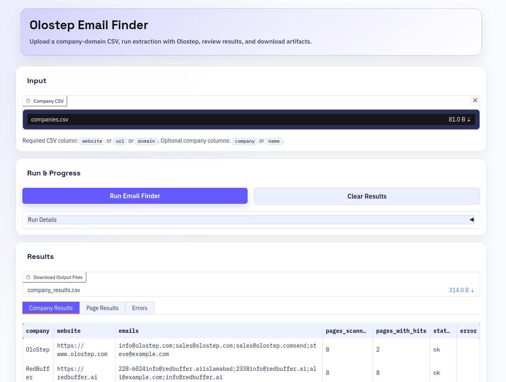

# Email Finder for Company Websites (with Olostep)

A lightweight **email finder for company websites** built with **Python and the Olostep API**.

This project takes a CSV of company domains, finds likely contact-related pages, extracts publicly available business emails, and exports structured results.

It is built for **B2B lead generation, sales prospecting, outreach prep, and market research**.



## Core project flow

The workflow is simple:

1. load company websites from a CSV
2. discover likely contact-related pages
3. process selected pages with **Olostep Batch**
4. extract public email addresses from structured results
5. deduplicate and aggregate emails per company
6. export company-level and page-level outputs

This makes the repo useful as a **Python email finder**, **website email scraper**, and **company email extraction workflow**.

## Project structure

The project is organized around a small async pipeline:

- `main.py` — main entrypoint
- `app.py` — frontend entrypoint
- `config/settings.py` — runtime settings
- `src/app.py` — CLI flow
- `src/email_finder.py` — core pipeline
- `src/service.py` — reusable app/service run wrapper
- `src/frontend.py` — Olostep-branded frontend UI
- `src/maps_client.py` — Olostep Maps client
- `src/batch_scraper.py` — Olostep Batch client
- `src/models.py` — data models
- `utils/email_tools.py` — email extraction helpers
- `utils/url_tools.py` — URL normalization and page selection
- `utils/io.py` — input/output helpers
- `utils/logger.py` — logging setup

## Requirements and setup

Create a virtual environment and install dependencies:

```bash
python -m venv .venv
source .venv/bin/activate
pip install -r requirements.txt
```

Create a `.env` file:

```bash
OLOSTEP_API_KEY=your_olostep_api_key_here
```

Most runtime values such as batch size, page limits, and timeouts are configured in:

```bash
config/settings.py
```

## Running the workflow

Run with default settings:

```bash
python main.py
```

Run with a custom input file and output directory:

```bash
python main.py --input companies.csv --output-dir output
```

### Run the Gradio frontend

Launch the local Gradio app:

```bash
python app.py
```

Optional host/port:

```bash
python app.py --host 0.0.0.0 --port 7860
```

The UI supports:

* CSV upload (`website` / `url` / `domain`)
* live run progress and stage logs
* company/page/error result tables
* one-click download of output CSV/JSON files

## Input format

The input is a CSV containing company websites.

Required column:

* `website`
  or
* `url`
  or
* `domain`

Optional company name columns:

* `company`
* `name`

Example:

```csv
company,website
Stripe,stripe.com
Brex,brex.com
Notion,notion.so
```

## Output files

The workflow writes:

* `output/company_results.csv`
* `output/company_results.json`
* `output/page_results.csv`
* `output/page_results.json`
* `output/errors.json`

These outputs make it easy to review results, debug failures, and move discovered emails into spreadsheets, CRMs, or enrichment workflows.

## How it works

For each company website, the pipeline:

* normalizes the domain
* builds a small set of likely contact-related URLs
* uses **Olostep Maps** to discover additional pages
* selects the best candidate pages
* processes those pages with **Olostep Batch**
* retrieves structured results from `@olostep/extract-emails`
* extracts and deduplicates email addresses
* aggregates final results per company

This keeps the workflow focused on pages like **contact, support, about, team, and legal pages**, where public business emails are most likely to appear.

## Configuration

Key runtime behavior is controlled in `config/settings.py`, including:

* map depth
* max pages per site
* max batch items
* concurrency
* poll interval
* poll timeout

This makes it easy to tune the workflow for small prospect lists or bulk email discovery.

## Use cases

This project is useful for:

* **B2B lead generation**
* **sales prospecting**
* **company website email extraction**
* **outreach list building**
* **market research**
* **public business contact discovery**

## Tech stack

* **Python**
* **Gradio**
* **Olostep Maps**
* **Olostep Batch**
* **@olostep/extract-emails**
* **CSV / JSON outputs**

## Why this repo

This repo does one job well: **find public business emails from company websites in a simple, structured, and scalable way**.

Instead of scraping an entire site, it focuses on the pages most likely to contain contact information, making it practical for real outreach and research workflows.
